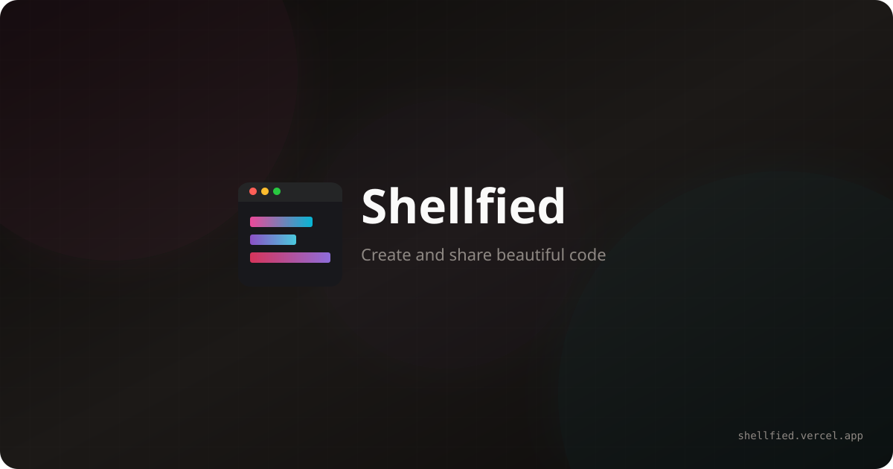

<p align="center">
  
</p>

<h1 align="center">Shellfied</h1>

<p align="center">
  <strong>Beautiful code screenshots in seconds</strong>
</p>

<p align="center">
  The official web companion to <a href="https://github.com/tool3/shellfie">shellfie</a> — create stunning SVG terminal screenshots on the fly.
</p>

<p align="center">
  <a href="https://shellfied.vercel.app">Live Demo</a> •
  <a href="https://github.com/tool3/shellfie">shellfie library</a> •
  <a href="https://github.com/tool3/shellfie-cli">shellfie CLI</a>
</p>

---

## What is Shellfied?

Shellfied is the go-to web application for creating beautiful code and terminal screenshots without any installation.   
Paste your code or terminal output, customize the appearance, and export as SVG or PNG — all from your browser. 

**Powered by [shellfie](https://github.com/tool3/shellfie)** — the same 0 dependencies engine that powers the CLI tool.

## Features

- **Real-time Preview** — Every update is visible in milliseconds
- **Compare mode** — Compare 2 code/terminal outputs side by side.
- **Syntax Highlighting** — Automatic highlighting for Bash, JavaScript, TypeScript, Python, and JSON
- **35 Terminal Themes** — Including Dracula, Dracula Pro ;),  Nord, Tokyo Night, One Dark, Monokai, and more
- **3 Window Styles** — macOS, Windows, or minimal
- **Full Customization** — Control font size, line height, padding, title, and watermark
- **Social posts** — Control background color, gradient, image with preset image ratios.
- **Export Options** — Download as SVG or PNG (1x, 2x, 3x scale)
- **PWA Support** — Install as a native app, works offline
- **Dark/Light Mode** — Matches your system preference

## The Shellfie Ecosystem

| Package | Description |
|---------|-------------|
| [shellfie](https://github.com/tool3/shellfie) | Core library for generating SVG terminal screenshots |
| [shellfie-cli](https://github.com/tool3/shellfie-cli) | Command-line tool for terminal-to-image conversion |
| **shellfied** | This web app — shellfie as a service |

## Development

```bash
# Install dependencies
npm install

# Start development server
npm run dev

# Build for production
npm run build

# Preview production build
npm run preview
```

## Tech Stack

- **React 19** + **TypeScript**
- **Vite** — Lightning-fast builds
- **Zustand** — Lightweight state management
- **SCSS Modules** — Scoped styling
- **Prism.js** — Syntax highlighting
- **vite-plugin-pwa** — Progressive Web App support

## License

MIT © [tool3](https://github.com/tool3)

---

<p align="center">
  <sub>Powered by <a href="https://github.com/tool3/shellfie" target="_blank">shellfie</a></sub>
</p>


![aaa](http://localhost:3001/api/image?d=N4IgtiBcIG4JYFMDuIA0IAuALKID2AdggCICGATgNZqZy4DGeANnuQAQakBGTCN9uADoFBghAG0ALAA4A3AFZZABjBs1StqIkqtUuYoCMqtQc1jxO8zIWyATMba2z2sLuuKAzA4-OLrq-qykg6SvpYS7goO8mH%2BEYEAbA4JsW6BAOwO6akBNtIO0jnxNgCcDiVFejYGKiYauuFVhkYmpg1xTbIG9iZO7WnVXiY%2B-bmGwSaho8WG8sYGMf0iY11JJinTnQaZJtmbkQb5JoX7gQZlJhWnNra1jvXmjZG2LY5tjx3PPY59HwOKtiGjhGfxWtgmjimoJmdjmalsi2hnVsa0cGyRzx2jj2GMCtiOjhOuJuF0cV2JnjuHgeLn%2Bsg8rwZqWWMI83zZlUiHiB3M5gQ8EIFfJsHjhbFFws8qI86NpKw8WIVkvpBI8RLlrNJHnJGs6kju%2BuVklexqN30kv11kUkQJtRohkihVsCkjFrqNqMksr8dMkWL9zN9BJkRtJkh1PpW8ju0eV8le8bj33klsjMPkQIzcYh8idac68jFhbjqPk3qegXkWKrcYJ8nV%2Bci8lJzeVCTu7bbrwS72dNgS3wHbaBCRBtJZnQSEKnbbFCURfcUCVRy7bWISOMXsgSBJ3bdJCQjFZs6Tup%2BV6Vel4v33SqePinSQKfF4h6TzD9k6TF34vqPS5afBkWLpJujYZAS6QNp%2B6SkrBgYrNIdxIcq0ivGhqHfNI95AXkQLSGO4F5BC0gfrhijSGKlGoai0iAXS0hYoxqEEtI0HkbI0iklxyolHcfG8a8JS9kRiglN84m8UCJSEZ%2BJQQvJvFiiUC4%2BhOkQlKimm8ViJRgXJBIlOxdIlKSpnKjUtSWRZSgtDUImfjUPROTZQw1LJHE1BMXk2XCNSqY5ShrDU9ErDUOzhTZRw1MZYVKBcNRHp5NSqAYNQWWlqVpQhMJpc53QZW5BgeXSaXeQYZGlQsWUBclwUGKFuXbFl%2BnJdFhwZQl5wWbcqW3D1dkvD1zm2DhpWAn1JVheCfWVdNfkIj1wUoj1EW2K1wjjdF%2BI9QlthJaV1KpdSFkMsdDmeWyx1jWF3LHVNuUCsdc2PX5ErXIYMrHY1WwKsdG23dFaqnQl2oWfqqWGh9XTGpDF2lRakM3blNqQyV6lnI6kMvVsrqQ7VCPBV64MRQG0MVdFIbk%2BGkMHWF0apbG5Pxoz8P085KYWRmjMPVsuaMzjByFozBP08FZZcxFNbM9F9ZcwlrZLKV7apZ25M9qrbO5QOqvI1so6q7zBxTqrgtnPOqui9rwWrurEUbhZO6q7F2sJYeFmnql57k5eXta1sd5e3rBxPl7RtnO%2BXtm9U35ewTGMx8FAEexFoEe9FUEewl8Hk0hqUobndkYbnznYRZBH5%2BH1Skfn0eGJR%2BdW1sdH5z9ByMfnAO5Wx%2Bcu83CU8eTfGpQJQ92cJOVbOJI-B2cMkj1XhjySPdddCpI9Nwcmkj23c8RXpFlGSPfdbwl5nQ7ctSX8qtwtLfN9KD0tyzzcShDLci92EoEy3Kvtxwv-B%2Baxbi71fjsW4G0E4AiUEcW4J88TxVULcOmMIXhX3ShfTKbx-bPG6EggqmD37FRvhVfBf9qpvE3niBq%2BDQEAmam8LuyJDj4PgTcc4%2BCUHIl6j8Gkok7AvCQUNC%2Bo0hEvwBBNH46M6SjR-uCG%2BCIhFUJuCiIRdCBHgPWgo2BO0REXFGlw54R1gR8M-ICO%2BTIL5XWBOIuwd1gSf0BD-IUViAHvQpHY4BMob5-WBEwoxsDgZWP0WDJWYIIaQlMRxcEd9TQX0RpCWx4J352niT-R0N88aQmUQCL0SDibxPAWTDx4JYFUxKTTSEhi8QM0cEzEpLM6k4JqU-TmF9uZ1McfzOpf9hZ1PjsIGgXAMC4AAObkFIAAE0QAQEZ6AuCjNILgBqkASg0DwLgAAzjAUZIAAC%2BQA)